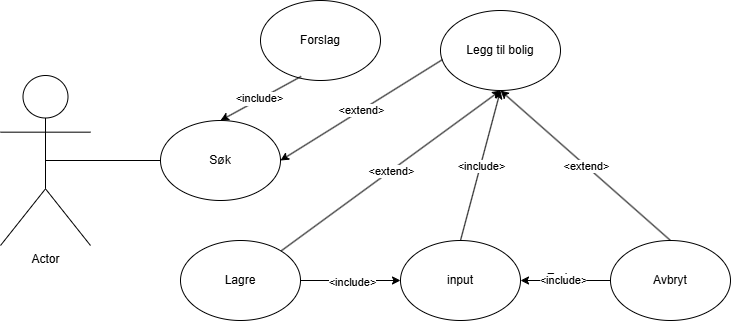

# Modellering
## Use Case Diagram
#### Brukerhistorier:

Som bruker:
- ønsker jeg å legge til detaljer om taket mitt(areal, vinkel, retning), slik at jeg kan lese estimater tilpasset min sitasjon.
- ønsker jeg å se et estimat på hvor mye strøm solcellene mine kan produsere årlig, slik at jeg kan vurdere om innvesteringen er verdt det.
- ønsker jeg å lagre detaljer om flere tak, slik at jeg kan sammenligne potensiale ved de ulike
- ønsker jeg å ha tilgang til korte forklaringer, slik at jeg kan forstå hva de ulike tingene betyr
- ønsker jeg å vite omtrent hva jeg kan drive med forventet produksjon
- ønsker jeg å kunne tilbakestille data, slik at jeg har kontroll over hvilke informasjon som er lagret i appen.
- ønsker jeg å få beskjed hvis noe går galt med API-innhenting eller internett, slik at jeg forstå hvorfor jeg ikke får se data.
- ønsker jeg å kunne bruke appen i både mørk og lys modus

#### Fra brukerhistorie til use case diagram:
Use case diagram brukes for å se hvordan systemet og aktører forholder seg til hverandre. Det er en "beskrivelse" av hvordan systemet oppnår et mål av verdi for en aktør.

Aktør: Bruker

Mål: å registrere en bolig i appen




## Sekvens diagram

** Tekstlig beskrivelse**

- Navn: Søke etter adresse og vise plassering  
- Prebetingelser: Brukeren har tilgang til appen og kan søke etter adresser  
- Postbetingelser: Kartet er oppdatert med valgt adresse, eller feilmelding vises


 Hovedflyt:

1. Bruker skriver inn en adresse i søkefeltet.  
2. Systemet henter forslag basert på søketeksten fra en ekstern datakilde.  
3. Forslagene vises i appen.  
4. Brukeren velger en adresse fra forslagene.  
5. Systemet sender adressen til geokodingstjeneste.  
6. Systemet mottar et gyldig `GeocodingResult`.  
7. Systemet trekker ut koordinater og formatterer adressen.  
8. Kartet oppdateres og flytter visningen til valgt lokasjon.  
9. Appen viser den formatterte adressen og oppdatert kartutsnitt.


Alternativ flyt

 A1: Ingen resultater fra geokoding

- 6a. Geokodingstjenesten returnerer `null`.  
- 7a. Systemet oppdaterer tilstanden med en feilmelding: `"No results found"`.  
- 8a. Appen viser en feilmelding til brukeren.

A2: Feil i API-kall

- 6b. Geokodingstjenesten kaster en `Exception` (f.eks. nettverksfeil eller API-feil).  
- 7b. Feilen fanges og feilmelding genereres basert på unntaket.  
- 8b. Appen viser en feilmelding basert på feilkoden eller feilmeldingen.


```mermaid

sequenceDiagram
    participant User as Bruker
    participant UI as MapScreen
    participant VM as MapViewModel
    participant Repo as MapRepository
    participant DS as MapDataSource

    Note over User, DS: Sekvensflyt (del 1): Søke etter adresse

    User->>VM: fetchSuggestions(query: String)
    VM->>Repo: getSuggestions(query: String)
    Repo->>DS: getSearchSuggestions(query: String)
    DS-->>Repo: returnerer List<String>
    Repo-->>VM: returnerer forslagene
    VM-->>UI: oppdaterer suggestions-flow med List<String>

    Note over User, DS: Sekvensflyt (del 2): Bruker velger adresse

    User->>VM: searchAddress(address: String)
    VM->>Repo: searchAddress(address: String)
    Repo->>DS: geocodeAddress(address: String)

    DS-->>Repo: returnerer GeocodingResult
    Repo-->>VM: returnerer GeocodingResult
    Note right of VM: handleSearchSuccess(result)
    VM->>VM: ekstraherer lat/lon fra result
    VM->>VM: lager LatLng objekt
    VM->>VM: formaterer displayName
    VM->>VM: oppdaterer MapUiState med koordinater og adresse
    VM->>VM: moveToLocation(location)
    VM->>VM: updateMarker()
    VM-->>UI: MapUiState oppdatert (coordinates, address)

    alt Ingen resultater
        DS-->>Repo: returnerer null
        Repo-->>VM: returnerer null
        VM->>VM: oppdaterer MapUiState med SearchState.Error("No results found")
        VM-->>UI: searchState = Error
    else API-feil
        DS--X Repo: kaster Exception
        Repo--X VM: kaster Exception
        VM->>VM: oppdaterer MapUiState med SearchState.Error(e.message)
        VM-->>UI: searchState = Error
    end
````

## Aktivitetsdiagram

Navn: bruker registrerer bolig

Prebetingelser: bruker har navigert seg i appen tidligere

Postbetingelser: Systemer lagrer en boligobjekt

Hovedflyt:

1. Bruker åpner appen
2. Bruker blir henvist til map screen 
3. Bruker trykker på søkefelt
4. Bruker skriver adresse i søkefelt 
5. bruker trykker på søkeknapp
6. drawupsheet blir synlig for bruker med info felt
7. Bruker fyller ut bolig info 
8. bruker trykker lagre
9. Systemet viser loading skjerm
10. Systemet lagrer lokasjon i databasen som en bolig objekt 
11. Appen konfigurer grafene i bakgrunnen
12. Bolig lagt til meldingsvarsel kommer på skjermen 
13. Bruker blir navigert til vanlig mapscreen igjen

Alternativ flyt:

3.1 Bruker velger kart zoom funksjon til å navigere seg frem

3.2 Bruker skriver adresse i søkefelt 

3.3 bruker trykker på søkeknapp

3.4 Systemet navigerer bruker til steg 6

Alternativ flyt:

7.2 bruker trykker avbryt 

7.3 Systemet navigerer bruker til steg 13

Altrnativ flyt:

5.1 bruker skriver inn en ugyldig adresse 

5.2 bruker får opp feilmelding og blir navigert til steg 2
```mermaid

---
config:
  theme: redux
---
flowchart TD
    Start([Start])
    Start --> ÅpneApp["Bruker åpner appen"]
    ÅpneApp --> MapScreen["Bruker blir henvist til map screen"]
    MapScreen --> ValgSøk{"Trykker bruker
     søkefelt?"}

    ValgSøk -->|Ja| TrykkSøkefelt["Bruker trykker 
    på 
    søkefelt"]
    TrykkSøkefelt --> SkrivAdresse["Bruker skriver
     adresse"]
    SkrivAdresse --> TrykkSøk["Bruker trykker på søkeknapp"]
    TrykkSøk --> ValgAdresseGyldig{"Er adressen 
    gyldig?"}

    ValgAdresseGyldig -->|Ja| InfoSheet["Drawupsheet 
    blir 
    synlig"]
    InfoSheet --> FyllUtBolig["Bruker fyller ut boliginfo"]
    FyllUtBolig --> ValgLagreAvbryt{"Trykker bruker lagre eller avbryt?"}

    ValgLagreAvbryt -->|Lagre| LagreBolig["Bruker trykker lagre"]
    LagreBolig --> Loading["Systemet viser loading-skjerm"]
    Loading --> LagreTilDB["Systemet lagrer lokasjon i databasen"]
    LagreTilDB --> KonfigurerGrafer["App konfigurerer grafer i bakgrunnen"]
    KonfigurerGrafer --> VisVarsel["'Bolig lagt til'-varsel vises"]
    VisVarsel --> TilbakeMap["Bruker navigeres til mapscreen igjen"]
    TilbakeMap --> End([Slutt])

    %% Alternativflyt 3.x – bruker navigerer med kart
    ValgSøk -->|Nei| ZoomKart["Bruker zoomer 
    i kartet"]
    ZoomKart --> SkrivAdresse2["Bruker skriver inn 
    adresse"]
    SkrivAdresse2 --> TrykkSøk2["Bruker 
    trykker 
    søkeknapp"]
    TrykkSøk2 --> InfoSheet

    %% Alternativflyt 7.x – bruker avbryter
    ValgLagreAvbryt -->|Avbryt| AvbrytHandling["Bruker
     trykker
     avbryt"]
    AvbrytHandling --> TilbakeMap

    %% Alternativflyt 5.x – ugyldig adresse
    ValgAdresseGyldig -->|Nei| FeilAdresse["Feilmelding vises"]
    FeilAdresse --> MapScreen
````

## Forklaring til klassediagrammet:
For enkelhetens skyld har vi valgt å utelate enkelte UI-komponentklasser fra diagrammet. Dette er gjort for å unngå at diagrammet blir visuelt overveldende og vanskelig å lese. I stedet har vi valgt å fokusere på å illustrere de viktigste koblingene mellom datasjiktet (repositories, datakilder og modeller) og hvordan disse delene er bundet sammen. Målet har vært å gi et tydelig overblikk over applikasjonens datastruktur og informasjonsflyt, fremfor å vise hver enkelt UI-del i detalj.

Hvis det likevel oppleves vanskelig å lese diagrammet i GitHub-visningen, kan det enkelt åpnes og utforskes i større format på Mermaid sin nettside ved å bruke den medfølgende lenken: https://www.mermaidchart.com/raw/d1839169-b9e0-4d88-a849-be1300b6fcc5?theme=light&version=v0.1&format=svg


```mermaid

classDiagram
direction LR
    class FrostDataSource {
	    - HttpClient ktorHttpClient
	    + getNearestStationIdResponse(lat: Double, lon: Double) : FrostStationResponse
	    + getWeatherObservationsResponse(stationId: String, elements: List, startDate: String, endDate: String) : FrostWeatherResponse
    }

    class FrostRepository {
	    - FrostDataSource dataSource
	    + getNearestStationId(lat: Double, lon: Double) : Station
	    + getWeatherObservation(stationId: String, elements: List, startDate: String, endDate: String) : List~Observation~
	    + getMonthlyWeatherData(stationId: String, startDate: String, endDate: String) : Map
	    + getMonthlySolarData(stationId: String, startDate: String, endDate: String, panelArea: Double, panelEfficiency: Double, systemLoss: Double, radiationList: List~Double~) : List~Double~
	    + getYearlySolarProduction(stationId: String, startDate: String, endDate: String, panelArea: Double, panelEfficiency: Double) : Double
    }

    class HKSDataSource {
	    - HttpClient client
	    + fetchElectricityPrices(params: HKSParams) : List~HKSPriceData~
    }

    class HKSRepository {
	    - HKSDataSource dataSource
	    + getElectricityPrices(params: HKSParams) : List~HKSPriceData~
	    + getCalculatedMonthlyAveragePrices(params: HKSParams) : List~Double~
    }

    class PVGISDataSource {
	    - HttpClient client
	    + fetchSolarData(params: SolarParams) : PVGISResponse
	    + fetchMonthlyRadiationData(params: SolarParams) : RadiationResponse
    }

    class PVGISRepository {
	    - PVGISDataSource dataSource
	    + getSolarData(params: SolarParams) : PVGISResponse
	    + getMonthlyRadiationData(params: SolarParams) : List~Double~
    }

    class MapDataSource {
	    + setupRasterLayers(style: Style) : Pair~RasterLayer, RasterLayer~
    }

    class MapSearchDataSource {
	    - HttpClient client
	    + geocodeAddress(address: String) : GeocodingResult?
	    + getSearchSuggestions(query: String) : List~String~
    }

    class MapRepository {
	    - MapSearchDataSource mapSearchDataSource
	    - MapDataSource mapDataSource
	    + searchAddress(address: String) : GeocodingResult?
	    + initializeMapStyle(style: Style, context: Context) : MapLayers
	    + getSuggestions(query: String) : List~String~
    }

    class MapLayers {
	    +RasterLayer osmLayer
	    +RasterLayer esriLayer
    }

    class HomeDao {
	    + insertHome(home: Home) : Long
	    + getAllHomes() : List~Home~
	    + getHome(lat: Double, lon: Double) : Home?
	    + deleteHome(home: Home)
	    + deleteHomeById(homeId: Int)
    }

    class FrostDao {
	    + insertFrostData(frostData: FrostDataEntity) : Long
	    + getFrostData(lat: Double, lon: Double) : FrostDataEntity?
	    + insertAllFrostMonthlyData(data: List~FrostMonthlyDataEntity~)
	    + getMonthlyFrostDataForCoordinates(lat: Double, lon: Double) : List~FrostMonthlyDataEntity~
	    + getMonthlyFrostDataFromHomeId(homeId: Int) : List~FrostMonthlyDataEntity~
    }

    class PVGISDao {
	    + insertPVGISData(data: PVGISDataEntity) : Long
	    + getPVGISData(lat: Double, lon: Double) : PVGISDataEntity?
	    + insertAllPVGISMonthlyData(data: List~PVGISMonthlyDataEntity~)
	    + getMonthlyPVGISDataForCoordinates(lat: Double, lon: Double) : List~PVGISMonthlyDataEntity~
	    + getMonthlyPVGISDataFromHomeId(homeId: Int) : List~PVGISMonthlyDataEntity~
    }

    class HKSDao {
	    + insertAllMonthlyData(data: List~HKSMonthlyDataEntity~)
	    + getAllMonthlyDataForYear(area: String, year: Int) : List~HKSMonthlyDataEntity~
	    + deleteAllMonthlyDataForYear(area: String, year: Int)
	    + deleteAllMonthlyData()
    }

    class AppDatabase {
	    + homeDao() : HomeDao
	    + frostDao() : FrostDao
	    + pvgisDao() : PVGISDao
	    + hksDao() : HKSDao
    }

    class DatabaseRepository {
	    - HomeDao homeDao
	    - FrostDao frostDataDao
	    - PVGISDao pvgisDao
	    - HKSDao hksDao
	    - FrostRepository frostRepository
	    - PVGISRepository pvgisRepository
	    - HKSRepository hksRepository
	    + saveHome(home: Home)
	    + saveFrostData(frostData: FrostDataEntity)
	    + savePVGISYearlyData(pvgisData: PVGISDataEntity)
	    + getAllHomes() : List~Home~
	    + getHome(lat: Double, lon: Double) : Home?
	    + getFrostData(lat: Double, lon: Double) : FrostDataEntity?
	    + getPVGISYearlyData(lat: Double, lon: Double) : PVGISDataEntity?
	    + getAllMonthlyHKSData(area: String, year: Int) : List~HKSMonthlyDataEntity~
	    + getAllMonthlyPVGISDataFromHomeID(homeId: Int) : List~PVGISMonthlyDataEntity~
	    + getAllMonthlyFrostDataFromHomeID(homeId: Int) : List~FrostMonthlyDataEntity~
	    + deleteHome(home: Home)
	    + deleteHomeById(homeId: Int)
    }

    class HKSParams {
    }

    class HKSPriceData {
    }

    class Station {
    }

    class Observation {
    }

    class Element {
    }

    class FrostStationResponse {
    }

    class FrostWeatherResponse {
    }

    class SolarParams {
    }

    class PVGISResponse {
    }

    class RadiationResponse {
    }

    class Style {
    }

    class RasterLayer {
    }

    class RasterSource {
    }

    class TileSet {
    }

    class GeocodingResult {
    }

    class PhotonResponse {
    }

    class FrostDataEntity {
    }

    class PVGISDataEntity {
    }

    class HKSMonthlyDataEntity {
    }

    class FrostMonthlyDataEntity {
    }

    class PVGISMonthlyDataEntity {
    }

    class Home {
	    +id: Int
	    +address: String
	    +latitude: Double
	    +longitude: Double
	    +roofAreal: Double
	    +roofAngle: Double
	    +roofDirection: String
	    +priceArea: String
    }

    class MapScreen {
	    +navController: NavHostController
	    +mapViewModel: MapViewModel
	    +sharedHomeViewModel: SharedHomeViewModel
    }

    class MapViewModel {
	    - mapRepository: MapRepository
	    - mapLibreMap: MapLibreMap?
	    - _uiState: StateFlow~MapUiState~
	    - _suggestions: StateFlow~List~
	    + uiState: StateFlow
	    + fetchSuggestions(query: String)
	    + searchAddress(address: String)
	    + setMapLibreMap(map: MapLibreMap, context: Context)
	    + toggleLayer()
	    + initializeMap(style: Style, context: Context)
	    + fetchSuggestions()
	    + searchAddress()
	    + toggleLayer()
    }

    class MapUiState {
	    + coordinates: LatLng?
	    + address: String?
	    + isLoading: Boolean
	    + isOsmVisible: Boolean
	    + searchState: SearchState
	    + cameraPosition: CameraPosition?
    }

    class SharedHomeViewModel {
	    + StateFlow~ homes
	    + StateFlow selectedHome
	    + homes: StateFlow~
	    + selectedHome: StateFlow
	    + loadHomes()
	    + selectHome(Home)
	    + saveNewHome(...)
	    + deleteHome(Home)
	    + loadHomes()
	    + selectHome(home: Home)
	    + saveNewHome(...)
	    + deleteHome(...)
    }

    class LoadingScreen {
    }

    class ProdScreen {
	    +selectedHome: Home?
	    +homes: List~Home~
	    +monthlyCostData: List~MonthlyCostData~
    }

    class ProfitabilityScreen {
	    +yearlySavings: Double
	    +yearlyProduction: Double
	    +sendsBack: Boolean
    }

    class ProdscreenViewModel {
	    - databaseRepository: DatabaseRepository
	    - _monthlyCostData: StateFlow~List~MonthlyCostData~~
	    - _funFacts: StateFlow~List~FunFact~~
	    + monthlyCostData: StateFlow~
	    + sendsBack: StateFlow
	    + loadDataForHome(home: Home)
	    + resetData()
	    + toggleSendBack(Boolean)
	    + loadDataForHome(home: Home)
	    + resetData()
	    + toggleSendBack()
    }

    class MapLibreMap {
    }

    class UserProfileScreen {
	    +sharedHomeViewModel: SharedHomeViewModel
	    +userViewModel: UserScreenViewModel
    }

    class UserScreenViewModel {
	    - MutableStateFlow _isInfoPopupVisible
	    - MutableStateFlow _isDropdownOpen
	    + StateFlow isInfoPopupVisible
	    + StateFlow isDropdownOpen
	    + isInfoPopupVisible: StateFlow
	    + toggleInfoPopup()
	    + showDropdown()
	    + hideDropdown()
	    + selectHome(home: Home, onSelected:(Home) -> Unit)
	    + toggleInfoPopup()
    }

    class AppNavigation {
	    +NavHost
	    +NavigationBar
	    +Crossfade
    }

    class NavigationViewModel {
	    - MutableStateFlow _navBarSelectedIndex
	    + StateFlow navBarSelectedIndex
	    - MutableStateFlow _startDestination
	    + StateFlow startDestination
	    + updateNavBarSelectedIndex(index: Int)
    }

    class SavingGraphDetailScreen {
    }

    AppNavigation --> NavigationViewModel
    AppNavigation --> SharedHomeViewModel
    AppNavigation --> MapScreen
    AppNavigation --> ProdScreen
    AppNavigation --> UserProfileScreen
    AppNavigation --> SavingGraphDetailScreen
    AppNavigation --> ProfitabilityScreen
    MapScreen --> MapViewModel
    ProdScreen --> ProdscreenViewModel
    SavingGraphDetailScreen --> ProdscreenViewModel
    UserProfileScreen --> UserScreenViewModel
    UserProfileScreen --> SharedHomeViewModel
    ProdScreen --> SharedHomeViewModel
    ProdScreen --> LoadingScreen
    ProdscreenViewModel --> DatabaseRepository
    ProfitabilityScreen --> ProdscreenViewModel
    MapScreen --> SharedHomeViewModel
    MapScreen --> LoadingScreen
    MapViewModel --> MapRepository
    MapViewModel --> MapUiState
    MapViewModel --> MapLibreMap
    DatabaseRepository --> FrostRepository
    DatabaseRepository --> PVGISRepository
    DatabaseRepository --> HKSRepository
    MapRepository --> MapSearchDataSource
    MapRepository --> MapDataSource
    MapRepository --> MapLayers
    MapSearchDataSource --> GeocodingResult
    MapSearchDataSource --> PhotonResponse
    MapDataSource --> RasterLayer
    MapDataSource --> Style
    MapLayers --> RasterLayer
    MapDataSource --> RasterLayer
    MapDataSource --> RasterSource
    MapDataSource --> TileSet
    PVGISDataSource --> PVGISResponse
    PVGISRepository --> PVGISDataSource
    PVGISDataSource --> SolarParams
    PVGISDataSource --> RadiationResponse
    HKSRepository --> HKSDataSource
    HKSRepository --> HKSPriceData
    HKSDataSource --> HKSParams
    HKSDataSource --> HKSPriceData
    FrostRepository --> FrostDataSource
    FrostRepository --> Station
    FrostRepository --> Observation
    FrostRepository --> Element
    FrostDataSource --> FrostStationResponse
    FrostDataSource --> FrostWeatherResponse
    AppDatabase -- FrostMonthlyDataEntity
    DatabaseRepository -- HomeDao
    DatabaseRepository -- FrostDao
    DatabaseRepository -- PVGISDao
    DatabaseRepository -- HKSDao
    HKSDao -- AppDatabase
    PVGISDao -- AppDatabase
    PVGISMonthlyDataEntity -- AppDatabase
    PVGISDataEntity -- AppDatabase
    HKSMonthlyDataEntity -- AppDatabase
    FrostDataEntity -- AppDatabase
    FrostDao -- AppDatabase
    HomeDao -- AppDatabase
    Home -- AppDatabase

	style FrostDataSource :,stroke-width:1px,stroke-dasharray:none,stroke:#374D7C,fill:#E2EBFF,color:#374D7C
	style FrostRepository :,stroke-width:1px,stroke-dasharray:none,stroke:#374D7C,fill:#E2EBFF,color:#374D7C
	style HKSDataSource :,stroke-width:1px,stroke-dasharray:none,stroke:#374D7C,fill:#E2EBFF,color:#374D7C
	style HKSRepository :,stroke-width:1px,stroke-dasharray:none,stroke:#374D7C,fill:#E2EBFF,color:#374D7C
	style PVGISDataSource :,stroke-width:1px,stroke-dasharray:none,stroke:#374D7C,fill:#E2EBFF,color:#374D7C
	style PVGISRepository :,stroke-width:1px,stroke-dasharray:none,stroke:#374D7C,fill:#E2EBFF,color:#374D7C
	style MapDataSource :,stroke-width:1px,stroke-dasharray:none,stroke:#374D7C,fill:#E2EBFF,color:#374D7C
	style MapSearchDataSource :,stroke-width:1px,stroke-dasharray:none,stroke:#374D7C,fill:#E2EBFF,color:#374D7C
	style MapRepository :,stroke-width:1px,stroke-dasharray:none,stroke:#374D7C,fill:#E2EBFF,color:#374D7C
	style MapLayers :,stroke-width:1px,stroke-dasharray:none,stroke:#374D7C,fill:#E2EBFF,color:#374D7C
	style HomeDao :,stroke-width:1px,stroke-dasharray:none,stroke:#374D7C,fill:#E2EBFF,color:#374D7C
	style FrostDao :,stroke-width:1px,stroke-dasharray:none,stroke:#374D7C,fill:#E2EBFF,color:#374D7C
	style PVGISDao :,stroke-width:1px,stroke-dasharray:none,stroke:#374D7C,fill:#E2EBFF,color:#374D7C
	style HKSDao :,stroke-width:1px,stroke-dasharray:none,stroke:#374D7C,fill:#E2EBFF,color:#374D7C
	style AppDatabase :,stroke-width:1px,stroke-dasharray:none,stroke:#374D7C,fill:#E2EBFF,color:#374D7C
	style DatabaseRepository :,stroke-width:1px,stroke-dasharray:none,stroke:#374D7C,fill:#E2EBFF,color:#374D7C
	style HKSParams :,stroke-width:1px,stroke-dasharray:none,stroke:#254336,fill:#27654A,color:#FFFFFF
	style HKSPriceData :,stroke-width:1px,stroke-dasharray:none,stroke:#254336,fill:#27654A,color:#FFFFFF
	style Station :,stroke-width:1px,stroke-dasharray:none,stroke:#254336,fill:#27654A,color:#FFFFFF
	style Observation :,stroke-width:1px,stroke-dasharray:none,stroke:#254336,fill:#27654A,color:#FFFFFF
	style Element :,stroke-width:1px,stroke-dasharray:none,stroke:#254336,fill:#27654A,color:#FFFFFF
	style FrostStationResponse :,stroke-width:1px,stroke-dasharray:none,stroke:#254336,fill:#27654A,color:#FFFFFF
	style FrostWeatherResponse :,stroke-width:1px,stroke-dasharray:none,stroke:#254336,fill:#27654A,color:#FFFFFF
	style SolarParams :,stroke-width:1px,stroke-dasharray:none,stroke:#254336,fill:#27654A,color:#FFFFFF
	style PVGISResponse :,stroke-width:1px,stroke-dasharray:none,stroke:#254336,fill:#27654A,color:#FFFFFF
	style RadiationResponse :,stroke-width:1px,stroke-dasharray:none,stroke:#254336,fill:#27654A,color:#FFFFFF
	style Style :,stroke-width:1px,stroke-dasharray:none,stroke:#254336,fill:#27654A,color:#FFFFFF
	style RasterLayer :,stroke-width:1px,stroke-dasharray:none,stroke:#254336,fill:#27654A,color:#FFFFFF
	style RasterSource :,stroke-width:1px,stroke-dasharray:none,stroke:#254336,fill:#27654A,color:#FFFFFF
	style TileSet :,stroke-width:1px,stroke-dasharray:none,stroke:#254336,fill:#27654A,color:#FFFFFF
	style GeocodingResult :,stroke-width:1px,stroke-dasharray:none,stroke:#254336,fill:#27654A,color:#FFFFFF
	style PhotonResponse :,stroke-width:1px,stroke-dasharray:none,stroke:#254336,fill:#27654A,color:#FFFFFF
	style FrostDataEntity :,stroke-width:1px,stroke-dasharray:none,stroke:#254336,fill:#27654A,color:#FFFFFF
	style PVGISDataEntity :,stroke-width:1px,stroke-dasharray:none,stroke:#254336,fill:#27654A,color:#FFFFFF
	style HKSMonthlyDataEntity :,stroke-width:1px,stroke-dasharray:none,stroke:#254336,fill:#27654A,color:#FFFFFF
	style FrostMonthlyDataEntity :,stroke-width:1px,stroke-dasharray:none,stroke:#254336,fill:#27654A,color:#FFFFFF
	style PVGISMonthlyDataEntity :,stroke-width:1px,stroke-dasharray:none,stroke:#254336,fill:#27654A,color:#FFFFFF
	style Home :,stroke-width:1px,stroke-dasharray:none,stroke:#254336,fill:#27654A,color:#FFFFFF
	style MapScreen fill:#dfb8cd,stroke:#FFCDD2
	style MapViewModel fill:#ca7f4d,fill:#73a57f,stroke:#254336
	style MapUiState fill:#73a57f,stroke:#254336
	style SharedHomeViewModel fill:#73a57f,stroke:#254336
	style LoadingScreen fill:#dfb8cd,stroke:#FFCDD2
	style ProdScreen fill:#dfb8cd,stroke:#FFCDD2
	style ProfitabilityScreen fill:#dfb8cd,stroke:#FFCDD2
	style ProdscreenViewModel fill:#73a57f,stroke:#254336
	style MapLibreMap fill:#73a57f,stroke:#254336
	style UserProfileScreen fill:#dfb8cd,stroke:#FFCDD2
	style UserScreenViewModel fill:#73a57f,stroke:#254336
	style AppNavigation fill:#d4a5a5,stroke:#000000
	style NavigationViewModel fill:#73a57f,stroke:#254336
	style SavingGraphDetailScreen fill:#dfb8cd,stroke:#FFCDD2

	class FrostDataSource:::Sky
	class FrostRepository:::Sky
	class HKSDataSource:::Sky
	class HKSRepository:::Sky
	class PVGISDataSource:::Sky
	class PVGISRepository:::Sky
	class MapDataSource:::Sky
	class MapSearchDataSource:::Sky
	class MapRepository:::Sky
	class MapLayers:::Sky
	class HomeDao:::Sky
	class FrostDao:::Sky
	class PVGISDao:::Sky
	class HKSDao:::Sky
	class AppDatabase:::Sky
	class DatabaseRepository:::Sky
	class HKSParams:::Pine
	class HKSPriceData:::Pine
	class Station:::Pine
	class Observation:::Pine
	class Element:::Pine
	class FrostStationResponse:::Pine
	class FrostWeatherResponse:::Pine
	class SolarParams:::Pine
	class PVGISResponse:::Pine
	class RadiationResponse:::Pine
	class Style:::Pine
	class RasterLayer:::Pine
	class RasterSource:::Pine
	class TileSet:::Pine
	class GeocodingResult:::Pine
	class PhotonResponse:::Pine
	class FrostDataEntity:::Pine
	class PVGISDataEntity:::Pine
	class HKSMonthlyDataEntity:::Pine
	class FrostMonthlyDataEntity:::Pine
	class PVGISMonthlyDataEntity:::Pine
	class Home:::Pine
	class MapScreen:::Class_02
	class MapViewModel:::Class_01
	class MapUiState:::Class_03
	class SharedHomeViewModel:::Class_01
	class LoadingScreen:::Class_02
	class ProdScreen:::Class_02
	class ProfitabilityScreen:::Class_02
	class ProdscreenViewModel:::Class_01
	class MapLibreMap:::Class_03
	class UserProfileScreen:::Class_02
	class UserScreenViewModel:::Class_03
	class AppNavigation:::Class_04
	class NavigationViewModel:::Class_03
	class SavingGraphDetailScreen:::Class_02


